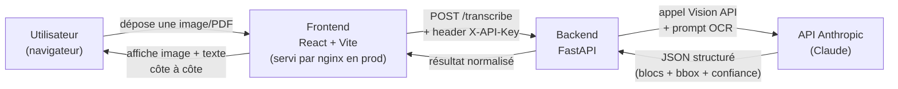

# Vue d'ensemble de l'architecture

> Dernière vérification par rapport au code : commit `4a30eae` (2026-09-04).

## Ce que fait l'application, en clair

Hakili OCR transforme une photo, un scan ou un PDF de **document administratif**
(tableau, formulaire, relevé, liste — manuscrit ou imprimé) en un texte structuré
et modifiable. Concrètement, un utilisateur :

1. dépose une image ou un PDF sur la page d'accueil ;
2. peut faire pivoter la page si elle est mal orientée, avant l'envoi ;
3. attend pendant que le document est analysé (quelques secondes pour une image,
   potentiellement plusieurs minutes pour un PDF de plusieurs centaines de pages,
   mais les premières pages s'affichent au fur et à mesure) ;
4. se retrouve face à un écran en deux colonnes : à gauche l'image d'origine avec
   des zones colorées (une boîte par bloc de texte détecté, verte/orange/rouge selon
   la fiabilité de la lecture), à droite le texte correspondant, reformaté en
   Markdown, avec les tableaux reconstitués ;
5. peut cliquer sur une zone pour la mettre en évidence, double-cliquer sur un
   texte ou une cellule de tableau pour le corriger, ou glisser une boîte mal
   positionnée ;
6. peut télécharger le résultat en Excel ou en PDF une fois la transcription
   terminée.

**Important pour comprendre le reste de la documentation** : le produit a été
repositionné en 2026-08-24 depuis un cas d'usage précédent ("copies de
mathématiques manuscrites") vers son usage actuel ("documents administratifs").
Des traces de ce passé subsistent volontairement dans le code (noms de dossiers,
quelques libellés d'interface comme "FORMULES" sur l'écran d'upload ou
"Vérification des formules…" sur l'écran de chargement — voir
[`decisions-et-limites-connues.md`](../decisions-et-limites-connues.md)) : elles
sont cosmétiques, sans impact fonctionnel, et n'ont pas toutes été nettoyées lors
du changement de positionnement.

## Les deux projets

Le dépôt contient deux applications indépendantes, sans outillage partagé, plus
une configuration Docker Compose à la racine qui les fait tourner ensemble :

```
ocr-app/
├── ocr-math-api/     # Backend Python/FastAPI — appelle Claude, sert l'API REST
│   ├── app/
│   │   ├── routers/       # Endpoints HTTP (transcription, corrections, export)
│   │   ├── services/      # Logique métier (appel Claude, jobs PDF, corrections, export PDF)
│   │   ├── models/        # Schémas Pydantic (contrat de données)
│   │   ├── utils/         # Fonctions utilitaires (images, erreurs)
│   │   ├── config.py       # Configuration (variables d'environnement)
│   │   ├── security.py     # Vérification de la clé API partagée
│   │   └── main.py         # Point d'entrée FastAPI
│   ├── data/               # SQLite + images de corrections (volume Docker en prod)
│   └── Dockerfile
├── hakili-ocr/       # Frontend React 19 + TypeScript + Vite — interface utilisateur
│   ├── src/
│   │   ├── components/     # Écrans et sous-composants React
│   │   ├── hooks/          # Logique d'état réutilisable
│   │   ├── context/        # État global (AppContext)
│   │   ├── services/       # Client HTTP vers le backend
│   │   ├── utils/          # Fonctions utilitaires pures
│   │   └── types/          # Types TypeScript partagés
│   ├── nginx.conf.template # Configuration nginx (headers de sécurité, CSP)
│   └── Dockerfile
├── docker-compose.yml
├── .env.example       # Variables lues par docker-compose.yml
└── docs/              # ← vous êtes ici
```

Chaque sous-projet a son propre `.env.example` (utilisé en développement local,
hors Docker) — voir [`04-configuration.md`](../backend/07-configuration.md)
(backend) et [`07-configuration.md`](../frontend/07-configuration.md) (frontend).

## Comment les deux projets communiquent

**Uniquement en HTTP** — aucun code partagé, aucun import croisé. Le frontend
appelle le backend via `fetch` (voir
[`06-services-api.md`](../frontend/06-services-api.md)), à l'URL définie par
`VITE_API_BASE_URL`.



- Le backend n'a **aucune dépendance** vers le frontend : il ne sert aucun
  fichier statique, ne connaît rien du rendu.
- Le frontend n'a **aucune logique métier OCR** : il envoie le fichier tel quel
  (après une éventuelle rotation) et affiche ce que le backend renvoie.
- L'authentification entre les deux est une clé partagée (`X-API-Key`), **pas**
  un vrai système d'auth utilisateur — voir
  [`security.md`](../security.md).

## Les trois flux de transcription

Le backend expose trois façons de transcrire un document, selon sa taille :

| Flux | Endpoint(s) | Quand | Détail |
|---|---|---|---|
| Image unique | `POST /transcribe` | Une image (PNG/JPEG) | [`02-flux-image.md`](02-flux-image.md) |
| PDF classique | `POST /transcribe/pdf/start` + `GET /transcribe/pdf/status/{id}` | PDF ≤ 30 pages | [`03-flux-pdf.md`](03-flux-pdf.md) |
| PDF par morceaux | `POST /transcribe/pdf/start-chunked` + `POST /transcribe/pdf/{id}/chunk` | PDF > 30 pages | [`04-flux-pdf-chunke.md`](04-flux-pdf-chunke.md) |

Le choix entre les deux flux PDF est fait **côté frontend**, automatiquement,
selon le nombre de pages (`PDF_CHUNK_PAGE_COUNT_THRESHOLD` dans
`hakili-ocr/src/utils/pdfChunking.ts`) — l'utilisateur ne voit aucune différence.

## Où aller ensuite

- Comprendre un flux en détail → les 3 fichiers de ce dossier (`02`, `03`, `04`).
- Modifier le backend → [`../backend/00-vue-ensemble.md`](../backend/00-vue-ensemble.md).
- Modifier le frontend → [`../frontend/00-vue-ensemble.md`](../frontend/00-vue-ensemble.md).
- Déployer / changer la configuration Docker → [`../deployment/01-docker-compose.md`](../deployment/01-docker-compose.md).
- Diagnostiquer une panne en production → [`../operations-runbook.md`](../operations-runbook.md).
- Comprendre pourquoi certains choix ont été faits (et ne pas les "corriger" par erreur) → [`../decisions-et-limites-connues.md`](../decisions-et-limites-connues.md).
