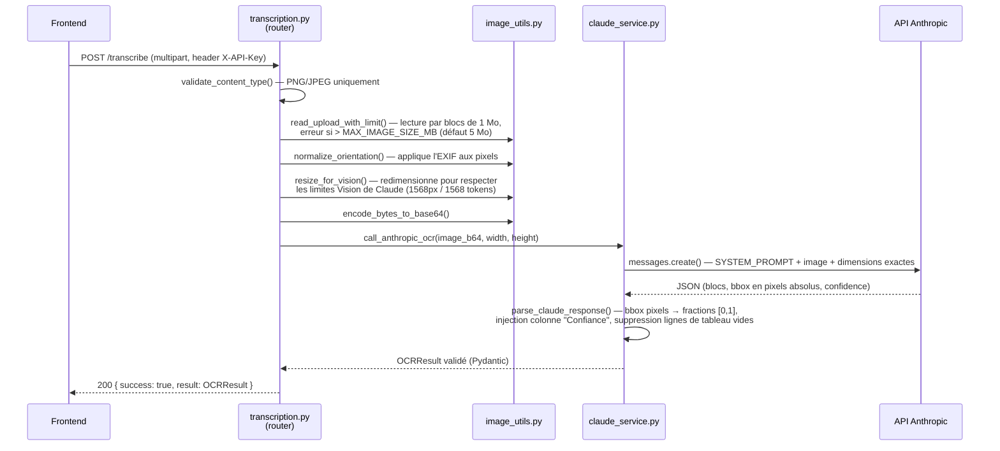

# Flux : transcription d'une image simple

> Dernière vérification : commit `4a30eae`. Code : `ocr-math-api/app/routers/transcription.py` (`transcribe_image`, `_process_single_image`), `ocr-math-api/app/services/claude_service.py`, `ocr-math-api/app/utils/image_utils.py`.

## En clair

L'utilisateur dépose une image (PNG ou JPEG, 5 Mo max). Le frontend l'envoie en
une seule requête HTTP et **attend la réponse complète** — pas de job en
arrière-plan pour ce cas, contrairement au PDF (voir
[`03-flux-pdf.md`](03-flux-pdf.md)). La réponse arrive en général en quelques
secondes.

## Séquence complète



## Étape par étape (fichiers et fonctions)

1. **Validation du type** — `validate_content_type()` (`image_utils.py`)
   n'accepte que `image/png`, `image/jpeg`, `image/jpg` ; normalise `jpg` en
   `jpeg`. Rejette avec `ValueError` → HTTP 400 sinon.
2. **Lecture avec plafond de taille** — `read_upload_with_limit()` lit le
   fichier par blocs de 1 Mo et lève une erreur **dès que** le budget
   (`MAX_IMAGE_SIZE_MB`, défaut 5 Mo) est dépassé, sans jamais bufferiser le
   fichier entier en mémoire d'abord. C'est la protection contre un client qui
   enverrait un fichier arbitrairement gros.
3. **Normalisation EXIF** — `normalize_orientation()` réencode l'image avec
   l'orientation EXIF appliquée physiquement aux pixels. Sans cette étape, une
   photo prise "à l'envers" mais taguée par le téléphone serait envoyée dans le
   mauvais sens à Claude, et les bbox retournées ne correspondraient plus à ce
   que l'utilisateur voit à l'écran.
4. **Redimensionnement Vision** — `resize_for_vision()` calcule les plus
   grandes dimensions possibles qui respectent à la fois la limite de bord
   (1568 px) et le budget de tokens Vision (~1568, calculé par tuiles de 28 px)
   de Claude. **Ce calcul est important à retenir** : les dimensions
   résultantes (`image_width`, `image_height`) servent aussi de référentiel
   pour normaliser les bbox à l'étape 7 — c'est ce qui garde les boîtes
   alignées avec l'image affichée côté frontend (qui reçoit exactement cette
   image redimensionnée, jamais l'originale).
5. **Encodage base64** — `encode_bytes_to_base64()`, trivial.
6. **Appel à Claude** — `call_anthropic_ocr()` (`claude_service.py`) envoie
   l'image et un prompt utilisateur qui rappelle les dimensions exactes (pour
   que Claude ne devine jamais de fraction lui-même). Voir
   [`../backend/02-service-claude.md`](../backend/02-service-claude.md) pour le
   détail du prompt, du retry/backoff et du sémaphore de concurrence.
7. **Parsing et normalisation** — `parse_claude_response()` :
   - extrait le JSON (retire les éventuelles balises ` ```json `) ;
   - supprime les blocs-ligne de tableau vides que Claude aurait générés sans
     donnée réelle ;
   - convertit chaque bbox de pixels absolus vers une fraction `[0,1]`, en
     divisant par `image_width`/`image_height` (celles de l'étape 4, pas les
     dimensions d'origine) ;
   - injecte la colonne "Confiance" dans chaque bloc-tableau, à partir du champ
     `confidence` du bloc lui-même (jamais retranscrit par Claude) ;
   - valide le tout contre le schéma Pydantic `OCRResult`.
8. **Réponse** — `transcribe_image()` renvoie `TranscriptionResponse(success=True, result=ocr_result)`.

## Gestion des erreurs à cette étape

| Cause | Exception levée | Code HTTP | Message |
|---|---|---|---|
| Type de fichier non supporté | `ValueError` | 400 | Message explicite (formats acceptés) |
| Fichier trop lourd | `ValueError` | 400 | Message explicite (taille limite) |
| JSON de Claude invalide / schéma non respecté | `ValueError` | 422 | "réponse Claude invalide" |
| Clé Anthropic manquante | `RuntimeError` | 500 | Message explicite |
| Erreur API Anthropic (429, 5xx, timeout...) | `anthropic.APIError` | 502 | Message classé par `describe_anthropic_error()` |
| Tout le reste (bug non prévu) | `Exception` | 500 | Message générique + référence courte (voir `errors.py`) |

Détail complet du raisonnement derrière chaque cas :
[`../operations-runbook.md`](../operations-runbook.md).

## Voir aussi

- [`../backend/01-routers.md`](../backend/01-routers.md) — le routeur complet, y compris les deux flux PDF.
- [`../backend/02-service-claude.md`](../backend/02-service-claude.md) — le prompt, le retry, le sémaphore.
- [`../backend/06-utils-securite.md`](../backend/06-utils-securite.md) — `image_utils.py` en détail.
- [`../frontend/03-hooks.md`](../frontend/03-hooks.md) — `useTranscribe.ts`, côté appelant.
