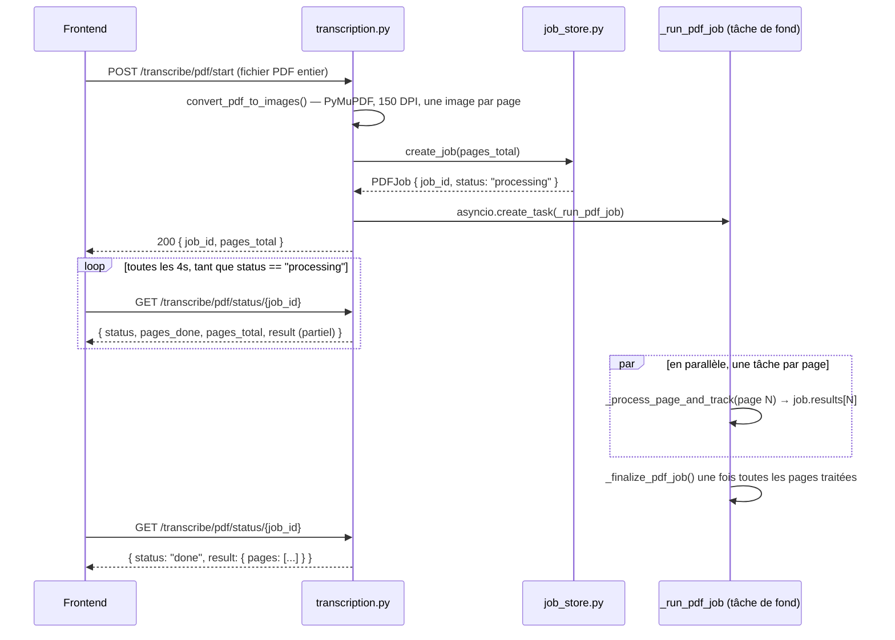

# Flux : transcription d'un PDF (classique, ≤ 10 pages)

> Dernière vérification : commit `4a30eae`. Code : `ocr-math-api/app/routers/transcription.py` (`start_pdf_transcription`, `_run_pdf_job`, `_process_page_and_track`, `get_pdf_transcription_status`), `ocr-math-api/app/services/job_store.py`.

## En clair

Un PDF n'est **jamais traité dans la requête HTTP qui l'envoie** — pour un
document de plusieurs dizaines ou centaines de pages, cela reviendrait à garder
une connexion ouverte pendant des minutes, ce qui est fragile (timeout proxy,
onglet fermé, etc.). À la place :

1. le frontend envoie le PDF complet en un seul `POST /transcribe/pdf/start` ;
2. le backend répond **immédiatement** avec un identifiant de job (`job_id`),
   avant même d'avoir transcrit la moindre page ;
3. le frontend interroge ensuite `GET /transcribe/pdf/status/{job_id}` toutes
   les 4 secondes (`PDF_POLL_INTERVAL_MS`) jusqu'à ce que le traitement soit
   terminé ;
4. dès que la **première page** est prête, l'utilisateur voit déjà le résultat
   à l'écran et peut commencer à le corriger — les pages suivantes continuent
   d'arriver en arrière-plan (voir la section "Affichage progressif" plus bas).

Ce flux est utilisé pour tout PDF de **10 pages ou moins**
(`PDF_CHUNK_PAGE_COUNT_THRESHOLD`, côté frontend). Au-delà, c'est le flux par
morceaux qui prend le relais — voir
[`04-flux-pdf-chunke.md`](04-flux-pdf-chunke.md). Les deux flux partagent le
même mécanisme de statut/polling et le même format de résultat final.

## Séquence complète

## Étape par étape

1. **Réception + rasterisation** — `start_pdf_transcription()` valide que le
   fichier est bien un PDF, le lit avec `read_upload_with_limit()` (plafond
   `MAX_PDF_SIZE_MB`, défaut 500 Mo), puis appelle `convert_pdf_to_images()`
   (PyMuPDF, `app/utils/image_utils.py`) qui rend chaque page en PNG à 150 DPI.
   Si le PDF dépasse `MAX_PDF_PAGES` (défaut 600), l'appel lève une erreur
   **avant** de rendre la moindre page — sinon un PDF de quelques Mo mais de
   milliers de pages déclencherait autant d'appels Claude payants.
2. **Création du job** — `create_job()` (`job_store.py`) génère un `job_id`
   (uuid4) et stocke un objet `PDFJob` dans un dictionnaire **en mémoire du
   process** (`_jobs`). C'est la limite structurelle la plus importante à
   connaître : voir [`../backend/03-service-jobs-pdf.md`](../backend/03-service-jobs-pdf.md).
3. **Lancement en arrière-plan** — `asyncio.create_task(_run_pdf_job(...))` :
   la fonction s'exécute de façon détachée, la requête HTTP répond tout de
   suite avec `{ job_id, pages_total }`. La tâche est gardée dans
   `_background_tasks` (un `set`) pour éviter qu'`asyncio` ne la ramasse par
   garbage collection en cours d'exécution (il ne garde qu'une référence
   faible aux tâches "fire-and-forget").
4. **Traitement parallèle des pages** — `_run_pdf_job()` lance un
   `asyncio.gather()` sur `_process_page_and_track()` pour **toutes les pages
   en même temps**. Le nombre d'appels Anthropic réellement simultanés reste
   borné par le sémaphore global à priorité (`ANTHROPIC_CONCURRENCY`, défaut 3 en test local / 2 en production — voir [`../decisions-et-limites-connues.md`](../decisions-et-limites-connues.md)) côté
   `claude_service.py` — voir
   [`../backend/02-service-claude.md`](../backend/02-service-claude.md). Chaque
   page réussie ou échouée incrémente `job.pages_done` immédiatement (pas
   seulement à la toute fin du `gather`), ce qui permet au polling de refléter
   une progression réelle.
5. **Résultat partiel pendant le traitement** — `GET /pdf/status/{job_id}`
   (`get_pdf_transcription_status()`) expose un `result` **dès qu'au moins une
   page est prête**, construit à la volée par `_build_pdf_result()` à partir de
   `job.results` (trié par numéro de page). `status` reste la seule source de
   vérité pour savoir si le document entier est fini — ne jamais déduire
   "terminé" de la simple présence de `result`.
6. **Finalisation** — une fois le `gather` terminé, `_finalize_pdf_job()`
   construit le `PDFTranscriptionResult` définitif et passe `job.status` à
   `"done"`. Si **aucune** page n'a réussi, `status` passe à `"error"` avec le
   dernier message d'erreur rencontré (trié par numéro de page).

## Affichage progressif côté frontend

Comme les pages sont traitées en parallèle, elles **terminent dans un ordre
arbitraire** — le backend peut avoir la page 5 avant la page 3.
`takeReadyPagePrefix()` (`hakili-ocr/src/hooks/useTranscribe.ts`) ne révèle que
le **préfixe contigu** de pages prêtes à partir de la page 1, tant que
`status === "processing"` : s'il affichait le tableau tel quel, l'index utilisé
partout côté frontend (`page_number - 1`) cesserait de correspondre à la bonne
page, et une page déjà affichée pourrait "changer" de contenu au poll suivant.
Une fois `status !== "processing"`, un trou restant est définitif (page en
échec permanent) — plus de filtrage à ce stade.

Détail de la mécanique React (reducer, `MERGE_PDF_RESULT`, etc.) :
[`../frontend/01-etat-global.md`](../frontend/01-etat-global.md) et
[`../frontend/03-hooks.md`](../frontend/03-hooks.md).

## Gestion des échecs par page

Une page qui échoue (erreur Anthropic ou bug inattendu) **n'annule pas les
autres** : `_process_page_and_track()` capture l'exception, l'ajoute à
`warnings`/`errors`, et continue. Le message visible côté utilisateur est :
- le message classé par `describe_anthropic_error()` si c'est une erreur
  Anthropic (ex. "service surchargé, réessayez") ;
- seulement le **nom du type d'exception** (`type(exc).__name__`) sinon — jamais
  le message brut, qui pourrait contenir un chemin de fichier ou un détail
  interne (voir [`../security.md`](../security.md)).

**Limite connue** : si la page 1 échoue définitivement mais que les pages
suivantes réussissent, rien ne s'affiche tant que le job n'est pas
complètement terminé — `takeReadyPagePrefix` ne révèle jamais rien sans la
page 1. Accepté tel quel (rare en pratique).

## Voir aussi

- [`04-flux-pdf-chunke.md`](04-flux-pdf-chunke.md) — la variante pour les gros documents.
- [`../backend/03-service-jobs-pdf.md`](../backend/03-service-jobs-pdf.md) — `job_store.py` en détail, y compris la purge des jobs expirés.
- [`../backend/02-service-claude.md`](../backend/02-service-claude.md) — sémaphore, retry, cache de prompt.
- [`../operations-runbook.md`](../operations-runbook.md) — que faire si un job PDF reste bloqué en production.
