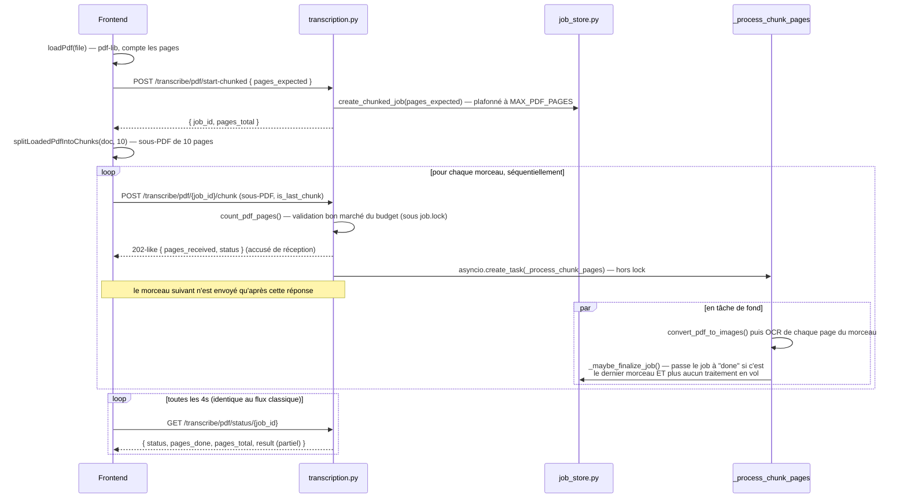

# Flux : transcription d'un PDF par morceaux (chunké, > 10 pages)

> Dernière vérification : commit `4a30eae`. Code : `ocr-math-api/app/routers/transcription.py` (section « Upload PDF par morceaux »), `hakili-ocr/src/utils/pdfChunking.ts`, `hakili-ocr/src/hooks/useTranscribe.ts` (`startPdfChunkedFlow`).

## En clair

Pour un très gros PDF (des centaines de pages), envoyer le fichier entier en un
seul upload avant de commencer le moindre traitement gaspille du temps :
upload et traitement OCR pourraient se chevaucher au lieu de s'enchaîner. Le
flux chunké résout ça : le frontend découpe le PDF en petits sous-PDF côté
client et les envoie **un par un**, et le backend commence à transcrire chaque
morceau dès sa réception, pendant que le morceau suivant est encore en train
d'arriver.

Ce flux est **transparent pour l'utilisateur** : c'est uniquement le nombre de
pages du PDF (> 10, `PDF_CHUNK_PAGE_COUNT_THRESHOLD`) qui décide, côté
frontend, s'il faut passer par ici plutôt que par le flux classique
([`03-flux-pdf.md`](03-flux-pdf.md)). Le polling de statut
(`GET /transcribe/pdf/status/{job_id}`) est **exactement le même** dans les
deux cas — aucune adaptation nécessaire côté affichage.

## Pourquoi découper côté client plutôt que côté serveur

Le découpage (`hakili-ocr/src/utils/pdfChunking.ts`) utilise `pdf-lib`, qui ne
fait que **recopier des pages** d'un document à un autre (`copyPages`/
`addPage`) — aucun rendu de pixel. Le seul rasteriseur réel du projet reste
PyMuPDF, côté backend, exactement comme pour le flux classique. Faire le
découpage côté client évite un aller-retour réseau supplémentaire (envoyer le
fichier entier au serveur pour qu'il le découpe lui-même).

## Séquence complète

## Étape par étape

1. **Ouverture du job** — `POST /pdf/start-chunked` ne reçoit **aucun fichier**,
   juste `pages_expected` (compté côté client via `pdf-lib`, avant tout envoi).
   `create_chunked_job()` (`job_store.py`) plafonne cette valeur à
   `MAX_PDF_PAGES` — un client ne peut pas contourner la limite en annonçant un
   nombre trop bas puis en envoyant plus de pages réparties sur plusieurs
   morceaux : cette valeur plafonnée devient le **budget cumulé** du job.
2. **Découpage côté client** — `splitLoadedPdfIntoChunks(doc, 20)` produit des
   sous-PDF de 10 pages (`PDF_CHUNK_SIZE_PAGES`) — volontairement au-dessus de
   `ANTHROPIC_CONCURRENCY` (2) pour qu'un morceau sature le sémaphore de
   traitement pendant que le suivant est envoyé.
3. **Envoi strictement séquentiel** — le frontend attend la réponse du morceau
   N avant d'envoyer le morceau N+1 (boucle `for` avec `await` dans
   `startPdfChunkedFlow`). C'est ce contrat qui permet au backend de numéroter
   les pages lui-même (`job.pages_received`), sans qu'aucun ordre n'ait besoin
   d'être communiqué par le client — et qui garantit qu'un seul morceau est en
   cours de réception à la fois, ce que `job.lock` fait respecter côté serveur
   (409 si un chevauchement est détecté).
4. **Réponse rapide côté serveur** — `upload_pdf_chunk()` ne fait, **sous
   verrou** (`job.lock`), que lire les octets (`read_upload_with_byte_limit`,
   avec un budget **restant** — `MAX_PDF_SIZE_MB` moins ce qui a déjà été reçu)
   et compter les pages (`count_pdf_pages`, qui n'ouvre que la structure du PDF
   sans rendre le moindre pixel). La rasterisation réelle (`convert_pdf_to_images`,
   coûteuse) est **différée** dans la tâche de fond `_process_chunk_pages()` —
   ce choix (changé le 2026-08-24) permet à cette étape de se chevaucher avec
   l'envoi du morceau suivant, au lieu d'ajouter une latence pure avant la
   réponse HTTP.
5. **Traitement du morceau** — `_process_chunk_pages()` rasterise le morceau
   puis lance un `asyncio.gather()` sur `_process_page_and_track()` pour ses
   pages, exactement comme le flux classique, mais en écrivant dans
   `job.results`/`job.warnings`/`job.errors` (des champs persistants du job,
   partagés entre tous les morceaux) plutôt que des listes locales à un seul
   appel.
6. **Détection de fin de job** — `_maybe_finalize_job()` s'exécute à la fin du
   traitement de **chaque** morceau (pas seulement le dernier envoyé — un petit
   morceau envoyé tôt peut finir de traiter après un gros morceau envoyé plus
   tard). Le job passe à `done`/`error` dès que `chunks_pending == 0` **et**
   `upload_finalized` (le morceau marqué `is_last_chunk=True` a été accepté).
   Aucun verrou n'est nécessaire ici : dans une seule boucle d'événements
   `asyncio`, rien ne peut s'intercaler entre la décrémentation et ce test.

## Que se passe-t-il si le client abandonne en cours de route ?

Si un utilisateur ferme l'onglet au milieu de l'envoi des morceaux, le job
reste `"processing"` avec `upload_finalized = False` pour toujours, à moins
qu'un mécanisme de purge n'intervienne. C'est le rôle de
`JOB_STALL_TIMEOUT_SECONDS` (défaut 30 min) dans `_purge_expired_jobs()`
(`job_store.py`) — voir
[`../backend/03-service-jobs-pdf.md`](../backend/03-service-jobs-pdf.md).

## Rasterisation d'un morceau : granularité de l'échec

Si `convert_pdf_to_images()` échoue pour un morceau (fichier corrompu, page
protégée), **toutes** les pages annoncées pour ce morceau sont marquées en
échec d'un coup (pas de granularité page par page dans ce cas précis, à la
différence d'un échec Claude sur une page individuelle) — un seul appel
`convert_pdf_to_images` couvre tout le morceau, impossible de savoir laquelle
des pages a fait échouer le rendu.

## Voir aussi

- [`03-flux-pdf.md`](03-flux-pdf.md) — le flux classique, et l'affichage progressif (identique dans les deux flux).
- [`../backend/03-service-jobs-pdf.md`](../backend/03-service-jobs-pdf.md) — `PDFJob`, ses champs spécifiques au mode chunké, la purge.
- [`../frontend/05-utils.md`](../frontend/05-utils.md) — `pdfChunking.ts`, `pdfDocCache.ts`.
