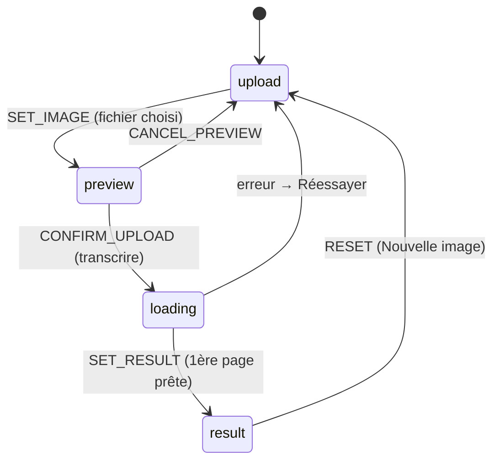

# Frontend — vue d'ensemble

> Dernière vérification : commit `4a30eae`. Projet : `hakili-ocr/`.

## Stack technique

- **React 19** + **TypeScript** + **Vite 8**.
- **Tailwind CSS v4** (via `@tailwindcss/vite`, configuration CSS-native dans
  `src/index.css` — pas de `tailwind.config.js`).
- **TanStack React Query** (`@tanstack/react-query`) — mutations réseau +
  polling du statut PDF.
- **react-markdown** + **remark-math**/**rehype-katex** (KaTeX) pour le rendu
  Markdown/LaTeX, **remark-gfm** (tableaux GFM), **remark-highlight-mark**
  (extension custom pour `==...==`).
- **pdfjs-dist** — aperçu client d'un PDF avant envoi (Web Worker).
- **pdf-lib** — rotation et découpage de PDF côté client (jamais de rendu de
  pixel, uniquement de la manipulation structurelle).
- **xlsx** (SheetJS, tarball auto-hébergé — voir
  [`07-configuration.md`](07-configuration.md)) — export Excel, chargé en
  lazy.
- Pas de router : un seul flux linéaire d'écrans piloté par un `useReducer`.
- **oxlint** comme linter (pas ESLint) ; aucun test runner configuré.

## Arborescence

```
hakili-ocr/
├── src/
│   ├── App.tsx                  # Racine applicative : routage des 4 écrans
│   ├── main.tsx                 # Point d'entrée Vite (QueryClientProvider, AppProvider)
│   ├── context/
│   │   └── AppContext.tsx       # État global (useReducer)
│   ├── components/
│   │   ├── UploadScreen.tsx     # Écran 1/4
│   │   ├── PreviewScreen.tsx    # Écran 2/4
│   │   ├── LoadingScreen.tsx    # Écran 3/4
│   │   ├── ResultScreen.tsx     # Écran 4/4 — orchestration pure
│   │   └── result/              # Sous-composants de l'écran Résultat
│   ├── hooks/                   # Logique d'état extraite (useTranscribe, useBlockEditing, etc.)
│   ├── services/                # Client HTTP (apiClient.ts, correctionsApi.ts)
│   ├── utils/                   # Fonctions pures (tableMarkdown, geometry, exports PDF/Excel...)
│   └── types/index.ts           # Types partagés (miroir des schémas backend + état applicatif)
├── nginx.conf.template          # Config nginx (headers sécurité + CSP), traitée au démarrage du conteneur
├── package.json
├── .env.example
└── Dockerfile
```

## Démarrer le frontend en local

```bash
cd hakili-ocr
npm install
cp .env.example .env      # VITE_API_BASE_URL, VITE_APP_API_KEY
npm run dev                # http://localhost:5173
```

Le backend doit tourner en parallèle (`http://127.0.0.1:8000` par défaut,
voir [`06-services-api.md`](06-services-api.md)).

Scripts disponibles (`package.json`) :

| Script | Rôle |
|---|---|
| `npm run dev` | Serveur de dev Vite |
| `npm run build` | `tsc -b && vite build` — vérifie les types **puis** build |
| `npm run lint` | oxlint |
| `npm run preview` | Sert le build de production localement |

Aucun test runner n'est configuré.

## Le flux applicatif en un coup d'œil

Quatre écrans, aucun router — un seul `state.currentScreen` piloté par
`AppContext` :



Détail de chaque écran → [`02-ecrans.md`](02-ecrans.md). Détail de l'état
global → [`01-etat-global.md`](01-etat-global.md).

## Mode démo sans backend

`useTranscribe.ts` a un flag `USE_MOCK` (actuellement `false`) qui, activé,
court-circuite tout appel réseau avec des données factices (`MOCK_RESULT`,
`MOCK_PDF_RESULT`) — utile pour développer l'interface sans backend ni clé
Anthropic. Voir [`03-hooks.md`](03-hooks.md).

## Où aller ensuite

- L'état global et ses actions → [`01-etat-global.md`](01-etat-global.md).
- Chaque écran en détail (y compris ce que voit l'utilisateur) → [`02-ecrans.md`](02-ecrans.md).
- Toute la logique réseau et d'édition → [`03-hooks.md`](03-hooks.md).
- Les composants de l'écran Résultat (image annotée, tableaux, drag de bbox) → [`04-composants-result.md`](04-composants-result.md).
- Les fonctions utilitaires pures (parsing markdown, géométrie, exports) → [`05-utils.md`](05-utils.md).
- Le client HTTP → [`06-services-api.md`](06-services-api.md).
- Les variables d'environnement `VITE_*` → [`07-configuration.md`](07-configuration.md).
