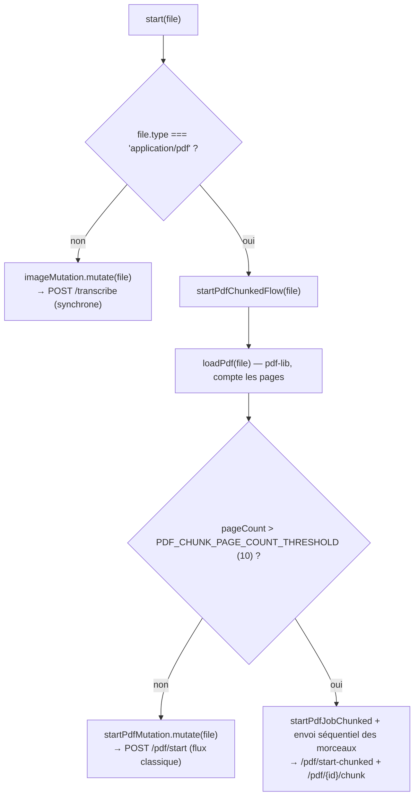

# Hooks — toute la logique d'état extraite des écrans

> Dernière vérification : commit `4a30eae`. Code : `hakili-ocr/src/hooks/*.ts`.

## `useTranscribe.ts` — le point d'entrée réseau

C'est le hook le plus important du frontend : il normalise les **deux flux
backend** (image synchrone vs PDF asynchrone par job, éventuellement chunké)
derrière une seule forme de retour.

```typescript
interface UseTranscriptionResult {
  start: (file: File) => void;
  isPending: boolean;
  isError: boolean;
  error: TranscribeError | null;
  progress: TranscriptionProgress | null;  // { pagesDone, pagesTotal } — PDF uniquement
  data: TranscriptionPayload | null;
}
```

### Décision du flux à l'appel de `start(file)`



Si `loadPdf(file)` échoue (PDF illisible côté client), le hook **retombe sur
le flux classique** plutôt que d'échouer silencieusement — c'est le backend
qui fera sa propre validation et renverra une erreur explicite.

### `takeReadyPagePrefix` — la fonction clé de l'affichage progressif

```typescript
function takeReadyPagePrefix(pages: PageResult[]): PageResult[] {
  const ready: PageResult[] = [];
  let expected = 1;
  for (const page of pages) {
    if (page.page_number !== expected) break;
    ready.push(page);
    expected += 1;
  }
  return ready;
}
```

Tant que `status === "processing"`, les pages du backend peuvent déjà contenir
la page 5 sans avoir la page 3 (traitement parallèle, ordre d'arrivée
arbitraire — voir
[`../architecture/03-flux-pdf.md`](../architecture/03-flux-pdf.md)). Cette
fonction ne garde que le **préfixe contigu** à partir de la page 1, en
s'arrêtant au premier trou. **Pourquoi c'est nécessaire** : sans ce filtrage,
l'index de tableau utilisé partout côté frontend (`page_number - 1`) cesserait
de correspondre à la bonne page, et une page déjà affichée pourrait "changer"
de contenu au poll suivant. Une fois `status !== "processing"`, plus de
filtrage — un trou restant est une page en échec permanent.

### État du flux chunké

- **`isChunkedStarting`** : comble la fenêtre entre l'appel à `start()` et le
  premier `pdfJobId` connu (comptage de pages + ouverture du job, avant tout
  envoi de morceau) — `startPdfMutation` ne couvre pas cette étape puisque le
  job est ouvert via `startPdfJobChunked`, une fonction différente.
- **`chunkUploadError`** : capture un échec de l'ouverture du job ou de
  l'envoi d'un morceau. **Doit rester dans la liste des conditions
  `isPdfFlow`** : si `POST /pdf/start-chunked` échoue avant que `pdfJobId` ne
  soit jamais posé, aucune autre condition ne serait vraie et l'erreur serait
  silencieusement perdue (spinner bloqué indéfiniment, sans message).

### Mode mock (`USE_MOCK`)

Un flag booléen en haut du fichier (actuellement `false`). Activé, il
court-circuite tout appel réseau : `mockTranscribe()` résout après un délai
fixe (`MOCK_DELAY_MS`) avec des données factices (`MOCK_RESULT`/`MOCK_PDF_RESULT`)
codées en dur dans le fichier. Utile pour développer/tester l'interface sans
backend ni clé Anthropic — **ne jamais laisser à `true` en production**.

## `useBlockEditing.ts` — édition d'un bloc simple

État local (`editingBlockId`, `editDraft`) pour l'édition en place d'un bloc
hors tableau. Double-clic → `handleStartEditBlock` (charge le markdown actuel
dans le brouillon) → `handleConfirmEditBlock` (dispatch
`UPDATE_BLOCK_MARKDOWN`, puis appelle `onConfirm` — câblé sur
`captureCorrection`, voir plus bas — **uniquement** si le texte a réellement
changé, laissé à la charge de l'appelant de vérifier).

## `useCellEditing.ts` — édition d'une cellule de tableau

Pendant de `useBlockEditing` mais à la granularité de la **cellule** (le
backend émet un bloc par ligne de tableau — voir
[`../backend/02-service-claude.md`](../backend/02-service-claude.md)).
Alimente `EditingCellContext`/`CellDraftContext` (voir
[`04-composants-result.md`](04-composants-result.md)), le découplage qui
permet à chaque cellule de se mémoïser indépendamment.

- `skipNextCellBlurRef` : évite qu'appuyer sur Échap (annulation) ne déclenche
  ensuite une revalidation via l'événement `blur` qui suit la fermeture du
  champ.
- `handleConfirmEditCell` recompose la ligne complète (`withReplacedCell`,
  voir [`05-utils.md`](05-utils.md)) avant de dispatcher
  `UPDATE_BLOCK_MARKDOWN` avec le markdown de la ligne entière (header +
  séparateur + nouvelle ligne de données).

## `useRowSelection.ts` — sélection de ligne débouncée

```typescript
const ROW_CLICK_DEBOUNCE_MS = 300;
```

Sélectionner une ligne de tableau dispatche `SELECT_BLOCK`, qui re-rend/met en
évidence la ligne. **Problème résolu ici** : si ça arrivait de façon synchrone
entre les deux clics d'un double-clic, le navigateur ne reconnaît plus la
séquence comme un `dblclick` (l'événement de sélection "casse" le timing
attendu par le navigateur). Le clic de sélection est donc différé de 300ms ;
`cancelPendingRowClick()` doit être appelé par un double-clic sur une cellule
de la **même** ligne avant l'échéance (câblé dans `ResultScreen.tsx`,
`handleCellDoubleClick`).

## `useCorrectionCapture.ts` — capture et envoi d'une correction

Capture un **instantané complet** (bloc, bbox, source image) **au moment de la
validation** d'une édition — pas au moment de l'ouverture de la modale — pour
que le crop (différé jusqu'à la validation de la modale, potentiellement
plusieurs secondes plus tard) reste correct même si l'utilisateur change de
page PDF entre-temps.

- `captureCorrection(block, correctedMarkdown)` : **ne se déclenche jamais**
  si `correctedMarkdown === block.markdown` (pas de changement réel) ou si
  `imagePreviewUrl` est absent.
- `handleSubmitCorrection(errorDescription)` : croppe l'image
  (`cropImageToBlob`, voir [`05-utils.md`](05-utils.md)) puis poste à
  `POST /corrections`. **Un échec ici est juste logué en console** — il ne
  bloque jamais l'utilisateur, la correction est une collecte de données
  secondaire, pas une action critique du flux principal.

## `useBlockDrag.ts` — déplacement d'une boîte (bbox)

State machine complète basée sur les **Pointer Events** (`pointerdown`/
`pointermove`/`pointerup`/`pointercancel`), pas l'API HTML5 Drag and Drop
(pensée pour transférer des données entre zones de dépôt, pas pour
repositionner un élément au pixel près).

- **`setPointerCapture`** (posé au `pointerdown`) route tous les événements
  suivants pour ce pointeur vers l'élément qui a démarré le drag, même si le
  curseur sort de ses limites — essentiel car certaines bbox sont minuscules
  (un seul chiffre).
- **`DRAG_THRESHOLD_PX = 4`** : distingue un clic d'un drag. En dessous de ce
  seuil de déplacement, `onClick` est appelé (comportement de sélection
  existant) plutôt que `onDragEnd`.
- **État à haute fréquence dans une ref, pas un state** : `dragStateRef` porte
  tout ce qui doit survivre entre les frames sans déclencher de re-render à
  chaque `pointermove`. Seul `dragOffset` (le delta courant) est un state
  React, et il n'est lu que via `DragOffsetContext` par le **seul** bloc en
  cours de déplacement — voir
  [`04-composants-result.md`](04-composants-result.md) pour pourquoi ça évite
  de re-rendre les boîtes voisines à chaque mouvement de souris.

## `usePdfPreview.ts` — aperçu client d'un PDF (`PreviewScreen`)

Rend chaque page d'un PDF en `data:` URL PNG côté client, via `pdfjs-dist`,
uniquement pour l'aperçu avant envoi — **aucune influence** sur le fichier
réellement transmis au backend (qui garde PyMuPDF comme seul rasteriseur
réel, voir [`../architecture/01-vue-ensemble.md`](../architecture/01-vue-ensemble.md)).
Re-rend toutes les pages à chaque changement de `file`, annule le rendu en
cours si `file` change entre-temps (flag `cancelled` fermé sur l'effet).

Utilise `workerPort` (un `Worker` déjà instancié, `pdfWorkerEntry.ts`
ci-dessous) plutôt que `workerSrc` (une simple URL) — nécessaire pour que le
polyfill posé dans `pdfWorkerEntry.ts` s'exécute **avant** que `pdfjs-dist` ne
l'utilise, dans le scope isolé du Worker.

## `pdfWorkerEntry.ts` — point d'entrée du Web Worker pdfjs, avec polyfill

Ce fichier existe pour contourner un bug de compatibilité précis : le build
`pdf.worker.min.mjs` de `pdfjs-dist` utilise `Promise.withResolvers` en
interne, une méthode **ES2024** récente (non supportée avant Firefox 121 /
Chrome 119 / Safari 17.4), **sans aucun fallback**. Sur un navigateur plus
ancien, l'appel échoue **à l'intérieur du Worker**, de façon asynchrone, sans
jamais déclencher l'événement `error` du Worker ni rejeter la promesse de
`getDocument()` côté thread principal — l'aperçu PDF reste alors
**indéfiniment vide**, `isLoading` bloqué à `true`, sans rien dans la
console.

Le correctif : un polyfill de `Promise.withResolvers` posé **dans le scope du
Worker lui-même** (un polyfill côté thread principal n'aurait aucun effet — un
Worker a son propre global scope isolé), avant l'`import 'pdfjs-dist/build/pdf.worker.min.mjs'`
qui suit. Si l'aperçu PDF reste vide en production sans erreur visible,
**vérifiez en premier que ce fichier est bien chargé avant pdfjs** (ordre des
imports) plutôt que de chercher un bug de rendu ailleurs.

## Voir aussi

- [`01-etat-global.md`](01-etat-global.md) — les actions dispatchées par ces hooks.
- [`04-composants-result.md`](04-composants-result.md) — les composants qui consomment ces hooks et les contextes associés.
- [`05-utils.md`](05-utils.md) — `geometry.ts`, `tableMarkdown.ts`, `cropImage.ts`, utilisés par plusieurs de ces hooks.
- [`../architecture/03-flux-pdf.md`](../architecture/03-flux-pdf.md) — le contexte backend derrière `useTranscribe.ts`.
